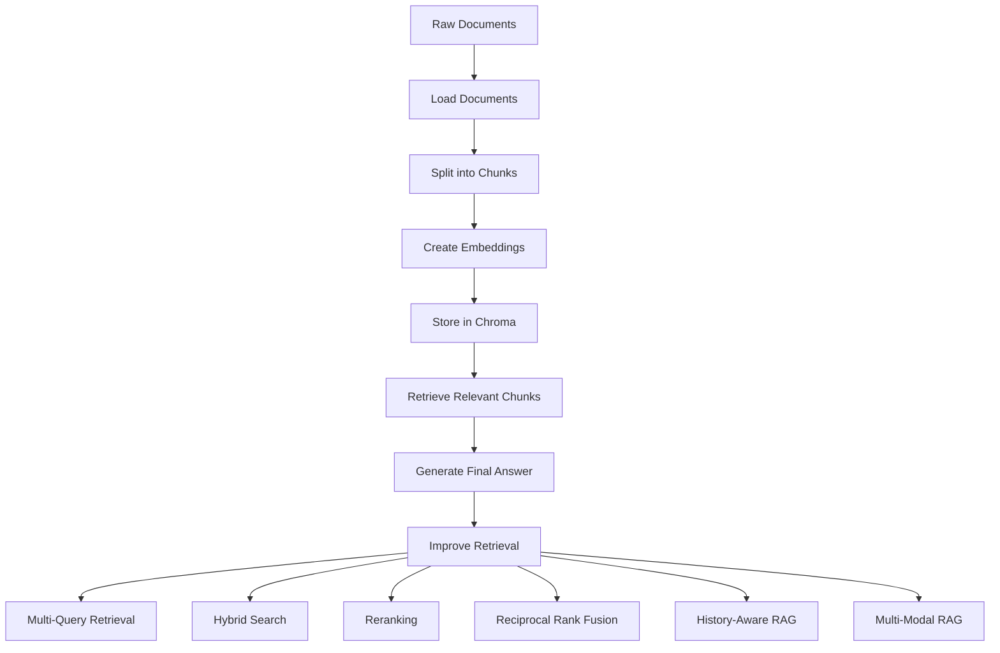
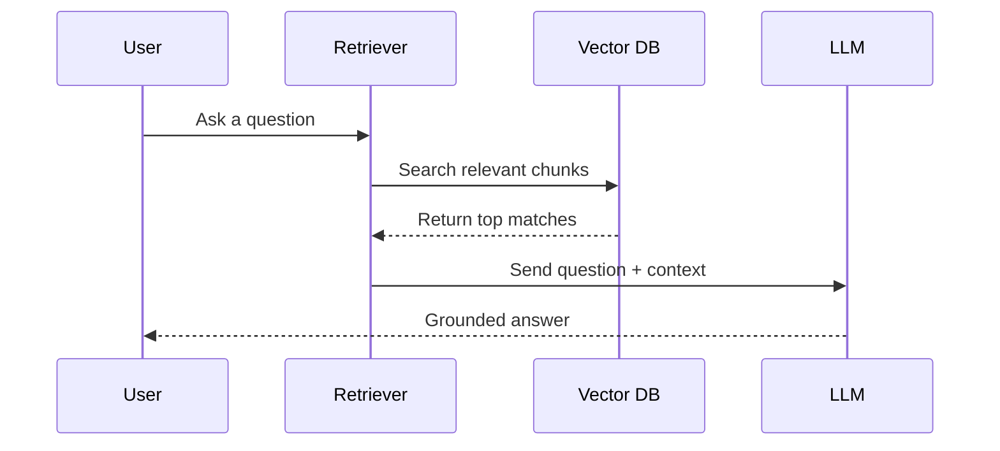

# RAG From Basics to Advanced Retrieval

<div align="center">


**A professional educational repository that explains how Retrieval-Augmented Generation works step by step, from simple ingestion to advanced retrieval strategies like hybrid search, reranking, and reciprocal rank fusion.**

</div>

---

## Overview

This repository is designed as a **learning path** for developers who want to understand how modern RAG systems are built.
Instead of presenting one large codebase, the project breaks the topic into small focused files so you can study each building block independently.

The code covers:
- Document ingestion and chunking
- Vector embeddings and Chroma storage
- Retrieval and answer generation
- History-aware RAG
- Recursive, semantic, and agentic chunking ideas
- Multi-query retrieval and rank fusion
- Multi-modal RAG
- Hybrid search and reranking

---

## Learning Map



---

## Repository Structure

### Core pipeline files

| File | What it demonstrates |
|---|---|
| `1_ingestion_pipeline.py` | Loads text files, splits them into chunks, creates embeddings, and stores them in Chroma. |
| `2_retrieval_pipeline.py` | Retrieves the most relevant chunks from the vector database for a user query. |
| `3_answer_generation.py` | Uses retrieved chunks as context and asks an LLM to generate an answer grounded in those documents. |
| `4_history_aware_generation.py` | Rewrites follow-up questions into standalone queries so retrieval works better in multi-turn chat. |

### Chunking strategy files

| File | What it demonstrates |
|---|---|
| `5_recursive_character_text_splitter.py` | Shows why recursive splitting is often safer than a single fixed separator. |
| `6_semantic_chunking.py` | Uses embedding-based chunk boundaries so related ideas stay together. |
| `7_agentic_chunking.py` | Demonstrates the idea of using an LLM to reason about logical chunk boundaries. |

### Advanced retrieval files

| File | What it demonstrates |
|---|---|
| `9_retrieval_methods.py` | Compares retrieval modes such as basic similarity, threshold filtering, and MMR. |
| `10_multi_query_retrieval.py` | Expands one question into several search queries to improve recall. |
| `11_reciprocal_rank_fusion.py` | Merges ranked retrieval results from multiple queries into one stronger ranking. |

### Notebook-based topics

| Notebook | What it demonstrates |
|---|---|
| `8_multi_modal_rag.ipynb` | Builds a RAG workflow that can read PDF text, tables, and images. |
| `12_hybrid_search.ipynb` | Combines lexical search and semantic retrieval in one educational example. |
| `13_reranker.ipynb` | Shows a two-stage retrieval design where retrieved candidates are reranked. |

### Supporting files

| File | Purpose |
|---|---|
| `synthetic_questions.txt` | Sample questions you can use to test the retrieval workflows. |
| `requirements.txt` | Python dependencies used across the examples. |

---

## Architecture Diagram



---

## What you will learn

By going through this repository, you will understand:

1. Why raw documents must be chunked before embedding.
2. How embeddings turn text into vectors for semantic search.
3. Why retrieval quality strongly affects final answer quality.
4. How advanced retrieval methods improve recall and precision.
5. Why multi-turn chat requires query rewriting.
6. How tables and images can be included in a multi-modal RAG workflow.

---

## Suggested order

If you are learning the topic for the first time, study the files in this order:

1. `1_ingestion_pipeline.py`
2. `2_retrieval_pipeline.py`
3. `3_answer_generation.py`
4. `4_history_aware_generation.py`
5. `5_recursive_character_text_splitter.py`
6. `6_semantic_chunking.py`
7. `7_agentic_chunking.py`
8. `9_retrieval_methods.py`
9. `10_multi_query_retrieval.py`
10. `11_reciprocal_rank_fusion.py`
11. `8_multi_modal_rag.ipynb`
12. `12_hybrid_search.ipynb`
13. `13_reranker.ipynb`

---

## Setup

```bash
python -m venv .venv
source .venv/bin/activate   # Linux / macOS
pip install -r requirements.txt
```

Create a `.env` file and add your API key:

```env
OPENAI_API_KEY=your_api_key_here
```

---

## Notes about the code style

This repository was prepared as a **teaching-first** codebase:
- Variable names are intentionally descriptive.
- Comments explain the purpose of each step in English.
- Files are small and focused so each concept is easy to study.
- The examples favor clarity over production hardening.

---

## Future improvements

Possible next steps for expanding this project:
- Add evaluation scripts for retrieval quality
- Add metadata filtering examples
- Add production-grade logging and error handling
- Add FastAPI endpoints for serving the RAG pipeline
- Add a UI for interactive querying

---

## License

This repository is suitable for educational use, experimentation, and portfolio demonstration.
